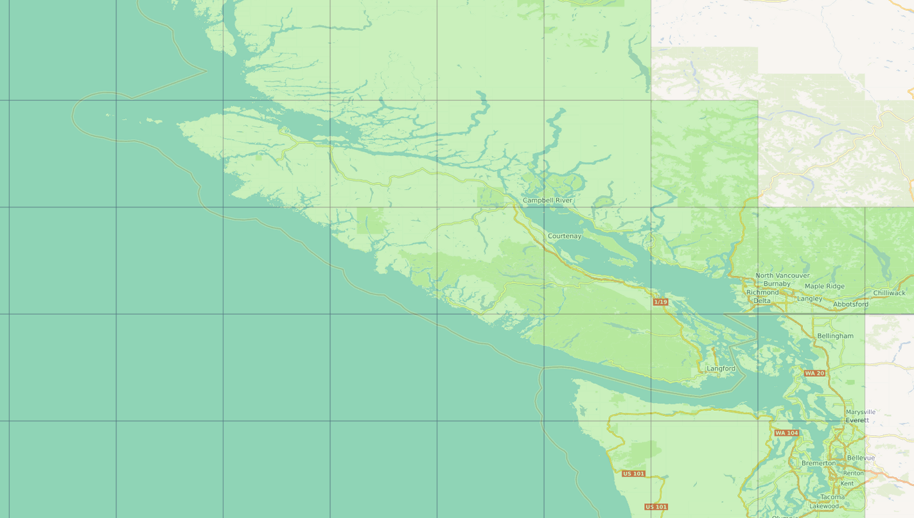
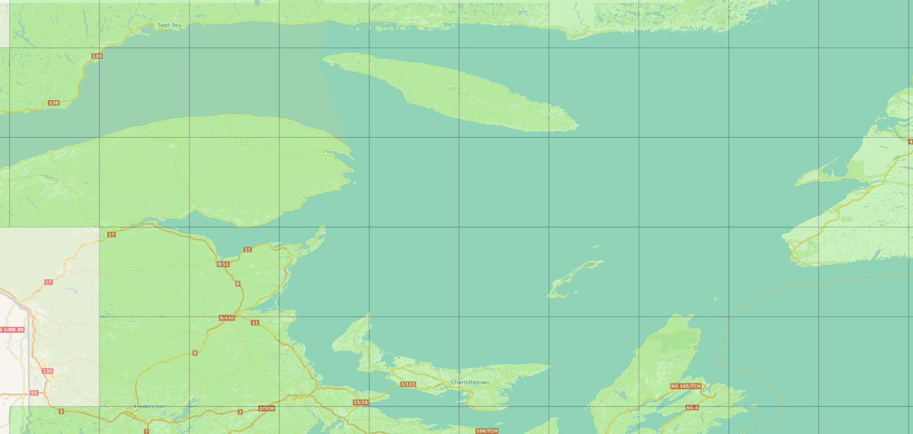

[En français](readme_riops_S111-datamart-alpha_fr.md)

# S-111 Dynamic Hydrographic Products(DHP) in HDF5 format using RIOPS(Regional Ice Ocean Prediction System) surface currents data. 

The S-111 Dynamic Hydrographic Products(DHP) for oceanographic models currents is in an open standard [ HDF5 ](https://www.hdfgroup.org/solutions/hdf5/) format with a specification provided by the [ International Hydrographic Organisation(IHO) ](https://iho.int). ECCC RIOPS model surface currents are used for this S-111 dataset.

# Data location

MSC testing data repository DD-Alpha data can be [automatically retrieved with the Advanced Message Queuing Protocol (AMQP)](../../msc-datamart/amqp_en.md) as soon as they become available. An [overview and examples to access and use the Meteorological Service of Canada's open data](../../usage/readme_en.md) is also available.

The data is available using the HTTP protocol and resides in a directory that is plainly accessible to a web browser. Visiting that directory with an interactive browser will yield a raw listing of links, each link being a downloadable HDF5 file. In practice, we recommend writing your own script to automate the downloading of the desired data (using wget or equivalent). If you are unsure of how to proceed, you might like to take a look at our brief wget usage guide.

The data can be accessed at the following URL:

* [https://dd.alpha.weather.gc.ca/model_riops/dynamic_hydrographic_products/hdf5/{HH}/](https://dd.alpha.weather.gc.ca/model_riops/dynamic_hydrographic_products/hdf5/)

* __HH__: RIOPS model synoptic run start hour, in UTC [00, 06, 12, 18].

# Files name nomenclature

NOTE: ALL HOURS ARE IN UTC.

The S-111 DHP tiled files have the following nomenclature:

CMC_riops_111CA002{nnnn}N{wwwww}W_{YYYYYMMDD}T{hh}Z.h

* __nnnn__: Tag of the decimal degrees latitude(Northern Hemisphere) of the South-West corner of the 1x1 degree tiles bounding boxes used.
* __wwwww__: Tag of the decimal degrees longitude(Western Hemisphere) of the South-West corner of the 1x1 degree tiles bounding boxes used.
* __YYYYYMMDD__: RIOPS model synoptic run start date, in UTC.
* __hh__: RIOPS model synoptic run start hour, in UTC [00, 06, 12, 18].

Example of a S-111 DHP tiled file name:

CMC_riops_111CA0024200N06900W_20200128T12Z.h

This file originates from the Canadian Meteorological Center (CMC) and contains RIOPS surface currents for the canadian coastal waters that were packaged as a 1x1 degree S-111 DHP tile which have its South-West corner located at latitude 42.00 and longitude -69.00. The RIOPS surface currents were produced on January 28 2020 at 12UTC 

# S-111 tiled files data structure

## Common Reference System(CRS)

The S-111 tiled files are using the [EPSG:4326](https://epsg.io/4326) as its GIS [CRS](https://docs.qgis.org/2.8/en/docs/gentle_gis_introduction/coordinate_reference_systems.html) to define all its geographical coordinates locations.

## Tiles extents
Each S-111 data file is a 1x1 degrees regular bounding box tiled subset of RIOPS surface currents data.

## Tiles Grid mapping 
The usage of the [EPSG:4326](https://epsg.io/4326) CRS and the data coding format 3 (Ungeorectified gridded data or point set data at one or more times) of the IHO S-111 format specification allows the direct usage, without any interpolation, of RIOPS data which itself use a north-polar stereographic projection with 5km resolution at the standard parallel 60° N.

## S-111 surface currents data objects
S-111 surface currents data objects are expressed as a Speed(in knots) and a Direction(navigation angle 0°-360°) data object using the [HDF5 H5T_COMPOUND type](https://bitbucket.hdfgroup.org/pages/HDFFV/hdf5doc/master/browse/html/cpplus_RM/class_h5_1_1_comp_type.html) to represent each RIOPS grid point data.

Example of one currents data objects structure for one tile for one timestamp:

DATATYPE H5T_COMPOUND { H5T_IEEE_F32LE "Direction";  H5T_IEEE_F32LE "Speed"; }

DATASPACE  SIMPLE { ( 228, 1 ) / ( 228, 1 ) }

  DATA { (0,0): { 168.927,0.123022 }, (1,0): { 110.585,0.093676 }, ... (227,0): {248.724, 0.0136034 } }

# Examples of canadian coastal waters tiled domains available

## 1x1 degree tiles bounding boxes for the Scotian shelf

## 1x1 degree tiles bounding boxes for the West-Coast

## 1x1 degree tiles bounding boxes for the Gulf of St. Lawrence

