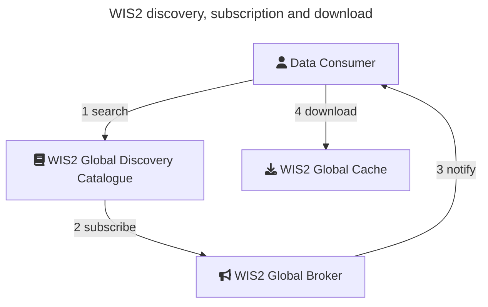

[En français](readme_fr.md)

[TOC](../readme_en.md) > WMO Information System (WIS2)

# WMO Information System (WIS2)

The WMO Information System 2.0 (WIS2) is the framework for WMO data sharing in the 21st century for all WMO domains and disciplines. It supports the WMO Unified Data Policy, the Global Basic Observing Network (GBON) and makes international, regional, and national data sharing simple, effective, and inexpensive. The idea that no Member should be left behind and the objective of lowering the barrier to adoption has been at the core of WIS 2.0 development. These objectives inspire the principles underpinning the WIS 2.0 technical framework, such as adopting open standards and Web technologies to facilitate sharing of increasing variety and volume of real-time data.

WIS2 has been in operation since January 2025 and replaces the Global Telecommunication System (GTS).

## Key documents

WIS2 Manuals and Guides can be found at the following locations:

* [Provisions for the Transition from the WMO Information System (WIS) 1.0 and Global Telecommunication System to WIS 2.0](https://library.wmo.int/records/item/69050-provisions-for-the-transition-from-the-wmo-information-system-wis-1-0-and-global-telecommunication-system-to-wis-2-0)
* [Manual on the WMO Information System, Volume II - WMO Information System 2.0](https://library.wmo.int/records/item/68731-manual-on-the-wmo-information-system-volume-ii-wmo-information-system-2-0)
* [Guide to the WMO Information System Volume II (DRAFT) - WMO Information System 2.0](https://wmo-im.github.io/wis2-guide/guide/wis2-guide-DRAFT.html)

For informative purposes, the [WIS2 Cookbook](https://wmo-im.github.io/wis2-cookbook/cookbook/wis2-cookbook-DRAFT.html) provides numerous examples, code snippets, recipes and workflows in support of WIS2 requirements.

## Discovery and access

Built on open standards, WIS2 supports FAIR data principles for free and unrestricted international data exchange.  WIS2 is powered by a Global Discovery Catalogue (GDC), which:

* Enables a data consumer to search and browse descriptions of data published to WIS2. Dataset descriptions (discovery metadata) provide information to determine the usefulness of the data and how it may be accessed
* Makes its content available for indexing by search engines
* Provides an Application Programming Interface (API) via the [OGC API - Records](https://ogcapi.ogc.org/records) standard

WIS2 search results provide "actionable" links that facilitate programmatic access and retrieval of data using various mechanisms:

* Raw data download (for example, via [MSC Datamart](../msc-datamart/readme_en.md))
* API access (for example, via [MSC GeoMet](../msc-geomet/readme_en.md))
* Data notifications using Pub/Sub (MQTT)

The WIS2 GDC is provided by the Meteorological Service of Canada (MSC) and is available at <https://wis2-gdc.weather.gc.ca/collections/wis2-discovery-metadata>.  This catalogue provides discovery services for all data on WIS2.

To discover Canadian data on WIS2, a user may query the GDC as follows:

* [Spatial query (all data over Canada)](https://wis2-gdc.weather.gc.ca/collections/wis2-discovery-metadata/items?bbox=-142,42,-52,84)
* Keyword search:
    * [All datasets with 'Canada'](https://wis2-gdc.weather.gc.ca/collections/wis2-discovery-metadata/items?q=canada)
    * [All datasets from MSC](https://wis2-gdc.weather.gc.ca/collections/wis2-discovery-metadata/items?q=%22ca-eccc-msc%22)
    * [Canadian prediction data](https://wis2-gdc.weather.gc.ca/collections/wis2-discovery-metadata/items?f=json&q=canada%20AND%20prediction)
    * [Canadian observations data](https://wis2-gdc.weather.gc.ca/collections/wis2-discovery-metadata/items?f=json&q=canada%20AND%20observations)

Note that the WIS2 GDC provides search results in HTML or JSON.  JSON results are made available by adding `f=json` to search queries.

The WIS2 GDC search results provide access links (raw data download, API, notifications).  For access to real-time data, a user can connect and subscribe ne of the WIS2 Global Brokers specified in the search results, via the MQTT protocol.

## Tools

Numerous tools exist to discover, access, subscribe to and retrieve data on WIS2, including: 

* [pywiscat](https://github.com/wmo-im/pywiscat): provides a Pythonic API atop the WIS2 Global Discovery Catalogue (GDC)
* [pywis-pubsub](https://github.com/wmo-im/pywis-pubsub): provides subscription and download capability of data from WIS2
