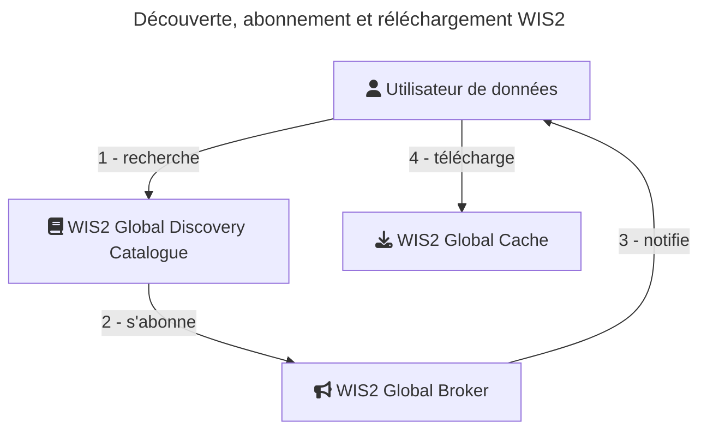

[In English](readme_en.md)

[TdM](../readme_fr.md) > Système d'Information de l'OMM (WIS2)

# Le Système d'Information de l'OMM (WIS2)

Le Système d'information de l'OMM 2.0 (WIS2) est le cadre de partage des données de l'OMM au 21e siècle pour tous les domaines et disciplines de l'OMM. Il soutient la Politique unifiée de données de l'OMM, le Global Basic Observing Network (GBON) et rend le partage de données internationales, régionales et nationales simple, efficace et peu coûteux. L'idée qu'aucun Membre ne devrait être laissé pour compte et l'objectif de réduire la barrière à l'adoption ont été au cœur du développement de WIS 2.0. Ces objectifs inspirent les principes sous-jacents au cadre technique de WIS 2.0, comme l'adoption de normes ouvertes et de technologies Web pour faciliter le partage d'une variété croissante et d'un volume croissant de données en temps réel.

WIS2 est en opération depuis janvier 2025 et remplace le Système global de télécommunication (GTS).

## Documents clés

Les manuels et guides WIS2 suivants sont disponibles (an anglais seulement) : 

* [Manual on the WMO Information System, Volume II - WMO Information System 2.0](https://library.wmo.int/idurl/4/68731)
* [Guide to the WMO Information System Volume II - WMO Information System 2.0](https://library.wmo.int/idurl/4/69130)
* [Provisions for the Transition from the WMO Information System (WIS) 1.0 and Global Telecommunication System to WIS 2.0](https://library.wmo.int/idurl/4/69050)
* [WMO Unified Data Policy for the International Exchange of Earth System Data (Resolution 1 (Cg-Ext(2021)))](http://library.wmo.int/idviewer/57850/15)

En tant qu'information additionnelle, le [WIS2 Cookbook](https://wmo-im.github.io/wis2-cookbook/cookbook/wis2-cookbook-DRAFT.html) fournit plusieurs exemples, extraits de code, recettes et processus en support aux exigences de WIS2.

## Découverte et accès

Bâtie sur des standards ouverts, WIS2 supporte les principes de données FAIR pour l'échange ouvert et libre de données internationales. WIS2 est propulsé par le Global Discovery Catalogue (GDC), qui :

* Permet à un utilisateur de données d'effectuer des recherches et de d'obtenir les descriptions des données publiées sur WIS2. La description des jeux de données (métadonnées de découverte) fournissent l'information nécessaire pour déterminer l'utilité d'un jeu de données et comment il peut être accédé
* Rend disponible le contenu afin qu'il puisse être indexé par les moteurs de recherche en ligne
* Fournit une interface de programmation d'applications (API) via le standard [OGC API - Records](https://ogcapi.ogc.org/records)

Les résultats de recherche WIS2 retournent des "liens actionnables" qui facilitent l'accès et le téléchargement automatisé des données par le biais de mécanismes variés :

* Téléchargement de données brutes, par exemple via le [Datamart du SMC](../msc-datamart/readme_fr.md)
* Accès et téléchargement par un API, par exemple via [GeoMet du SMC](../msc-geomet/readme_fr.md))
* Service de notification de données Pub/Sub (MQTT)

Le GDC de WIS2 est fournit par le Service météorologique du Canada (SMC) et est disponible à l'adresse <https://wis2-gdc.weather.gc.ca/collections/wis2-discovery-metadata>. Ce catalogue fournit les services de découverte pour toutes les données de WIS2.

Pour découvrir les données canadiennes sur WIS2, un utilisateur peut effectuer des requêtes au GDC telles que celles-ci : 

* [Requête spatiale (toutes les données couvrant le Canada)](https://wis2-gdc.weather.gc.ca/collections/wis2-discovery-metadata/items?bbox=-142,42,-52,84)
* Recherche par mot clé :
    * [Tous les jeux de données avec 'Canada'](https://wis2-gdc.weather.gc.ca/collections/wis2-discovery-metadata/items?q=canada)
    * [Tous les jeux de données du SMC](https://wis2-gdc.weather.gc.ca/collections/wis2-discovery-metadata/items?q=%22ca-eccc-msc%22)
    * [Données de prévision canadienne](https://wis2-gdc.weather.gc.ca/collections/wis2-discovery-metadata/items?f=json&q=canada%20AND%20prediction)
    * [Données d'observations canadiennes](https://wis2-gdc.weather.gc.ca/collections/wis2-discovery-metadata/items?f=json&q=canada%20AND%20observations)

Notez que les résultats de recherche du GDC de WIS2 sont disponibles au format HTML et JSON. Les résultats en JSON peuvent être obtenus en spécifiant `f=json` dans la requête.

Les résultats de recherche du GDC de WIS2 fournissent des liens d'accès (téléchargement de données brutes, API, notifications). Pour accéder aux données en temps réel, les utilisateurs peuvent se connecter et s'abonner aux WIS2 Global Brokers spécifiés dans le résultat de recherche, via le protocol MQTT.

## Outils

Plusieurs outils permettent de découvrir, accéder, s'abonner et télécharger des données de WIS2. Parmi ceux-ci :

* [pywiscat](https://github.com/wmo-im/pywiscat) : fournit un API Python pour exploiter le Global Discovery Catalogue (GDC) de WIS2
* [pywis-pubsub](https://github.com/wmo-im/pywis-pubsub) : permet de s'abonner et télécharger les données disponibles sur WIS2

## Support

Les services WIS2 du SMC sont opérationnels 24/7. Le support aux usagers est offert sur la base du meilleur effort durant les heures de travail normales. Les usagers désirant du support sont invités à [communiquer avec nous](https://weather.gc.ca/mainmenu/contact_us_e.html).
